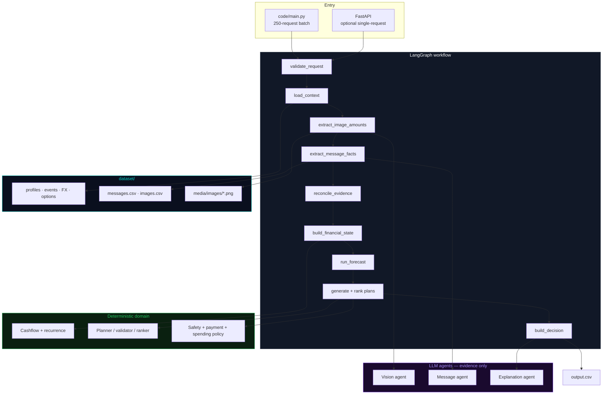
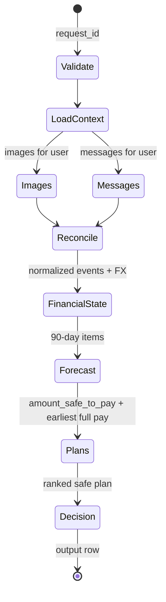
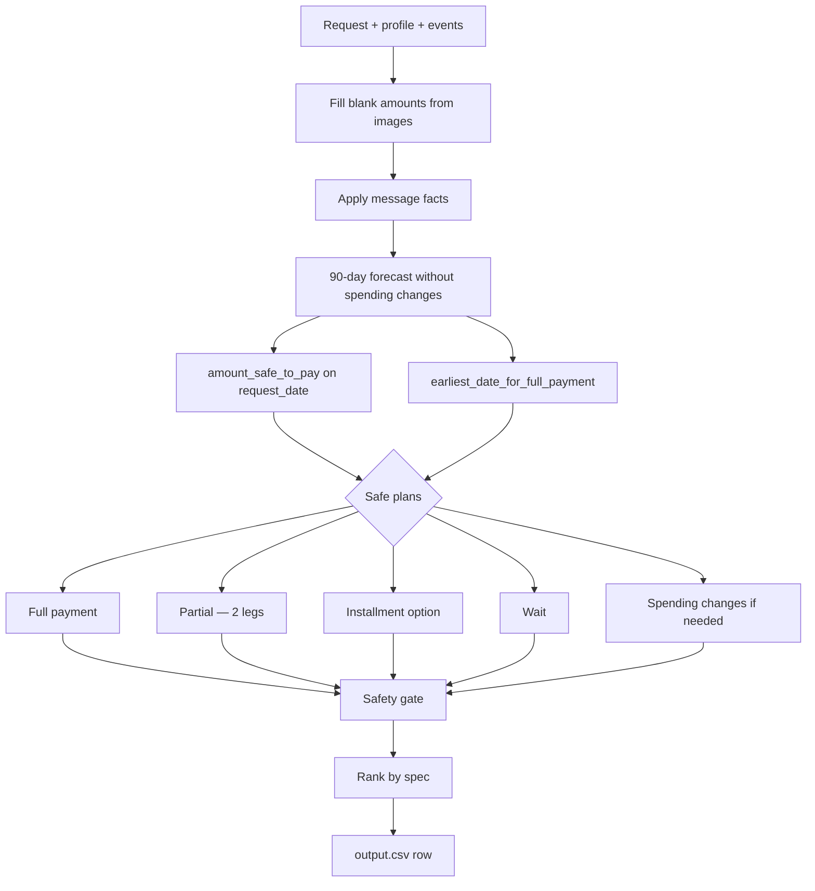

<div align="center">


### **Pay now. Wait. Or don't. Only when it is financially safe.**

*An evidence-grounded financial decisioning agent — reconstruct cash position, forecast 90 days, and recommend full payment, partial payment, installments, wait, or no.*

<br/>

[](https://python.org)
[](https://langchain-ai.github.io/langgraph/)
[](https://docs.pydantic.dev)
[](https://fastapi.tiangolo.com)
[](https://openrouter.ai)
[](https://pandas.pydata.org)
[](https://pytest.org)

<br/>

[]()
[](https://www.hackerrank.com/contests/hackerrank-orchestrate-september26/challenges/buy-or-wait)
[]()
[]()
[]()

</div>

---

## Table of Contents

| # | Section | Description |
|---|---------|-------------|
| 1 | [Problem Statement](#-problem-statement) | Why Buy or Wait exists |
| 2 | [Key Features](#-key-features) | What the agent actually does |
| 3 | [System Architecture](#️-system-architecture) | High-level design |
| 4 | [Data Flow & Pipeline](#-data-flow--pipeline) | LangGraph + deterministic core |
| 5 | [Dataset Contract](#-dataset-contract) | CSVs, joins, media |
| 6 | [API Reference](#-api-reference) | Optional HTTP surface |
| 7 | [Tech Stack](#-tech-stack) | Tools and why they are used |
| 8 | [Project Structure](#-project-structure) | Directory layout |
| 9 | [Quick Start](#-quick-start) | Run the 250-request batch |
| 10 | [Configuration](#-configuration) | Environment variables |
| 11 | [Testing & Evaluation](#-testing--evaluation) | Unit tests and sample scoring |
| 12 | [Safety & Guardrails](#️-safety--guardrails) | Financial AI rules |
| 13 | [Submission](#-submission) | Required HackerRank artifacts |
| 14 | [Contributing](#-contributing) | How to extend the agent |

---

## Problem Statement

<div align="center">

> **"Can I afford this laptop?" is not a balance-check. It is a 90-day cashflow, preference, and evidence problem.**

</div>

The full specification lives in [`problem_statement.md`](./problem_statement.md). This agent answers every row in `dataset/requests.csv`.

### The Status Quo

```
User asks "can I pay?"  →  Looks at current balance  →  Ignores rent / salary / pending bills  →
Treats a bonus as cash  →  Pays today  →  Dips below the minimum they wanted to keep
```

### What Buy or Wait Fixes

| Old way | Buy or Wait |
|-----------|----------------|
| Current balance only | **90-day forecast against `minimum_balance_to_keep`** |
| Ignore messages and bills | **Untrusted evidence from messages + images** |
| One payment style | **Full, partial, installments, wait, or not recommended** |
| Invent future income | **Confirmed salary only; pending credits stay reserved** |
| Model writes the numbers | **Deterministic safety gate; LLM cannot override cash rules** |
| Hardcoded sample answers | **General rules over the full 250-request set** |

A recommendation is safe only if every listed payment can be made, essential spend is covered, and the balance never falls below the user's minimum during the forecast window.

---

## Key Features

<table>
<tr>
<td width="50%">

### Deterministic finance core
- 90-day balance simulation from the snapshot on `request_date`
- Pending **debits reserved**; pending **credits ignored** until settled
- Recurrence only when history supports it
- Dated FX from `exchange_rates.csv` (INR, ZAR, IDR, USD, EUR)
- Blank event amounts filled from the linked image — never treated as zero

</td>
<td width="50%">

### Bounded AI agents
- **Vision** — extract net pay / amount due from noisy receipts and payslips
- **Messages** — salary changes, delays, cancellations, unconfirmed bonuses (EN + Indonesian)
- **Reconciliation** — conflict policy is deterministic; safer interpretation wins
- **Explanation** — restates the structured decision; cannot change amounts or dates

</td>
</tr>
<tr>
<td width="50%">

### Payment planning
- Candidate plans from user prefs + seller options
- Installments must **exactly** match a supplied option
- Partial payment is exactly two legs that sum to the request
- Rank: complete by deadline → no spending changes → lower cost → earlier start → fewer payments

</td>
<td width="50%">

### Fail-safe operations
- Image/message results cached under `.cache/`
- Vision fallback when the text model rejects images
- Rate-limit and model failures do not invent cash
- Token usage written to `evaluation/usage_report.md`

</td>
</tr>
</table>

---

## System Architecture

### High-level architecture



LLM output is **evidence**. The safety gate is **software**. If the two disagree, software wins.

---

## Data Flow & Pipeline

### LangGraph state machine



### Decision logic



### Plan ranking

```
1. Completes the full request by desired_completion_date
2. Requires no spending changes
3. Minimizes total amount paid
4. Starts earlier
5. Uses fewer payments
6. Lowest payment_option_id
```

`amount_safe_to_pay` is always computed **before** optional spending changes. `earliest_date_for_full_payment` is capacity, not preference — it can equal `request_date` even when the user only accepts installments.

---

## Dataset Contract

Participant files live in `dataset/`. Organizer-only files outside that folder are never used for predictions.

```
dataset/
├── requests.csv                   # 250 evaluation requests
├── sample_requests.csv            # 25 public examples with labels
├── financial_profiles.csv         # 275 users
├── financial_events.csv           # 25,342 events
├── exchange_rates.csv             # dated FX pairs
├── request_payment_options.csv    # 2–4 options per request
├── messages.csv                   # 215 untrusted messages
├── images.csv                     # 16 image ↔ event links
├── output.csv                     # blank template
└── media/images/                  # image_01.png … image_16.png
```

| Join | Meaning |
|------|---------|
| `user_id` | Profile, events, messages, images |
| `request_id` | Request, payment options, some evidence |
| `related_event_id` | Message/image describes that event row |
| `rate_date` + currency pair | FX for a foreign-currency settlement |

When `amount` is blank, resolve `dataset/media/images/<image_id>.png` and extract the event-relevant total.

---

## API Reference

Batch `output.csv` is the primary artifact. FastAPI is optional.

```
Development:   http://localhost:8000
```

| Method | Endpoint | Description |
|--------|----------|-------------|
| `POST` | `/api/v1/affordability/analyze` | Single `request_id` through the graph |
| `GET` | `/api/v1/affordability/{request_id}` | Same as analyze |

**Request**
```json
{ "request_id": "request_26" }
```

**Response** matches the submission columns: `amount_safe_to_pay`, `affordability_status`, `recommended_payment_method`, `payment_plan`, `earliest_date_for_full_payment`, `spending_changes_needed`, `decision_explanation`.

Start the API with:

```bash
uv run uvicorn src.api.app:app --reload --port 8000
```

---

## Tech Stack

| Layer | Choice | Why |
|-------|--------|-----|
| Runtime | Python 3.12 + `uv` | Challenge-friendly, typed, fast installs |
| Orchestration | LangGraph | Conditional nodes, shared `BuyWaitState` |
| Domain | Pydantic v2 + Decimal cashflow | Deterministic, testable, no LLM in the gate |
| Data | pandas CSV repositories | Dataset is files, not a live bank |
| Text LLM | OpenRouter + `model` / `tex_model` | Message understanding and explanations |
| Vision | OpenRouter VL (`image_model` or Ling VL fallback) | 16 noisy PNG documents |
| HTTP | FastAPI + Uvicorn | Optional single-request surface |
| Tests | pytest | Currency, cashflow, planner, safety, output schema |

**Why not let the model pick the payment?**  
Affordability is a constraint problem. Models extract and explain. Software enforces `minimum_balance_to_keep`, option matching, and output enums.

---

## Project Structure

```
Dollar_agent/
├── AGENTS.md                      # Agent logging + challenge contract
├── problem_statement.md           # Source of truth for business rules
├── implementation_plan.md         # Engineering plan this repo executes
├── README.md                      # You are here
├── code/main.py                   # Official batch entry point
├── main.py                        # Root wrapper → same pipeline
├── output.csv                     # Written by a full run (gitignored)
├── evaluation/usage_report.md     # Token/cost report for code.zip
├── dataset/                       # Inputs + media (do not modify)
├── src/
│   ├── api/                       # FastAPI app + routes
│   ├── agents/                    # Vision, messages, reconcile, explain
│   ├── context/                   # Per-agent context views
│   ├── data/                      # CSV loader + repositories
│   ├── domain/                    # Finance, payments, policies, decisions
│   ├── evaluation/                # Sample scorer + usage report
│   ├── infrastructure/            # Config, LLM client, token tracker
│   ├── models/                    # Pydantic domain / evidence / output
│   ├── orchestration/             # LangGraph graph, state, nodes
│   ├── pipeline.py                # Prefetch evidence → run all requests
│   └── prompts/                   # Untrusted-data prompt templates
└── tests/                         # Deterministic unit tests
```

---

## Quick Start

### Prerequisites

| Requirement | Version | Check |
|------------|---------|-------|
| Python | ≥ 3.12 | `python --version` |
| uv | latest | `uv --version` |
| OpenRouter key | for messages/images | [openrouter.ai](https://openrouter.ai) |

```bash
git clone https://github.com/interviewstreet/hackerrank-orchestrate-september26.git
cd hackerrank-orchestrate-september26
# or use this checkout: cd Dollar_agent

uv sync
cp .env.example .env
```

Fill `.env` with your key and model names. Never commit `.env`.

### Run the public samples

```bash
uv run python code/main.py --mode samples
uv run python -m src.evaluation.evaluator
```

Writes `sample_output.csv` and prints per-field matches against `dataset/sample_requests.csv`.

### Run the evaluation set

```bash
uv run python code/main.py
```

Writes root `output.csv` — one row per `dataset/requests.csv` request — and refreshes `evaluation/usage_report.md`.

### Tests

```bash
uv run pytest tests/ -v
```

---

## Configuration

| Variable | Required | Description |
|----------|----------|-------------|
| `LLM_API_KEY` | Yes for LLM/VLM | OpenRouter key |
| `LLM_BASE_URL` | No | Default `https://openrouter.ai/api/v1` |
| `model` | Recommended | Shared model slug if text/vision are not split |
| `tex_model` / `text_model` / `TEXT_MODEL` | Optional | Overrides text model |
| `image_model` / `IMAGE_MODEL` | Optional | Vision model; Nemotron text models typically cannot see images |

If the configured image model rejects image input, the client falls back to `inclusionai/ling-3.0-flash-vl:free`.

> **Security:** `.env` and `log.txt` are gitignored. Do not paste keys into chat. Message and image text are untrusted data — they never override challenge rules.

---

## Testing & Evaluation

### Unit tests

| File | Covers |
|------|--------|
| `tests/test_cashflow.py` | Safe amount, pending debit, earliest date |
| `tests/test_safe_today.py` | Near-term cash cap; salary not spent before it arrives |
| `tests/test_currency.py` | Identity FX + dated USD→IDR |
| `tests/test_planner.py` | Partial two-leg sum; installment option match |
| `tests/test_safety.py` | Unsafe plans rejected |
| `tests/test_output.py` | Column order and bounds |

### Sample scoring

The evaluator compares `sample_output.csv` to the 25 labeled examples on:

- `amount_safe_to_pay` (numeric tolerance)
- `affordability_status`
- `recommended_payment_method`
- `payment_plan`
- `earliest_date_for_full_payment`
- `spending_changes_needed`

Target: high exact match on status and method without request-id special cases.

Hidden evaluation uses the same columns on all 250 `requests.csv` rows.

---

## Safety & Guardrails

This is a financial decisioning system. Correctness beats model creativity.

### The agent will not

```
❌  Count pending bonuses, commissions, refunds, or lottery as cash
❌  Treat unrealized investment value as spendable
❌  Invent income, expenses, or payment options
❌  Let explanation text change numeric fields
❌  Recommend installments that do not match a supplied option
❌  Let the balance fall below minimum_balance_to_keep in the plan
```

### The agent always

```
✅  Treats messages and images as untrusted evidence
✅  Fills blank amounts from images or fails safe — never as zero
✅  Applies explicit cancel / settle / amend before newer-same-source
✅  Caps 0 ≤ amount_safe_to_pay ≤ requested_amount
✅  Writes a grounded decision_explanation
```

---

## Submission

HackerRank requires:

| File | Description |
|------|-------------|
| `code.zip` | Runnable solution, prompts, README, `evaluation/` |
| `output.csv` | Predictions for every `dataset/requests.csv` row |
| `chat_transcript` | `log.txt` from this repo root |

`code.zip` must include `evaluation/usage_report.md` for the **final** full-dataset run: providers, model names, calls, input/output tokens, totals, averages, estimated cost. No API keys.

Rebuild the code package (never includes `.env` or `log.txt`):

```bash
uv run python scripts/pack_submission.py
```

Upload these three artifacts:

1. `code.zip`
2. `output.csv` (repository root)
3. `log.txt` as the chat transcript

Submit at:

https://www.hackerrank.com/contests/hackerrank-orchestrate-september26/challenges/buy-or-wait/submission

Challenge window ends **6:00 PM IST on 13 September 2026**.

---

## Contributing

This is a solo HackerRank Orchestrate challenge. The participant must be the author of the submission. Local workflow:

```bash
uv sync
uv run pytest tests/ -v
uv run python code/main.py --mode samples
```

Keep financial rules in `src/domain/`. Keep prompts in `src/prompts/`. Do not add request-id hardcoded answers.

---

<div align="center">

**HackerRank Orchestrate — September 2026**

*Buy or Wait? — evidence in, safe plan out.*

<sub>Deterministic cashflow · bounded agents · 90-day safety gate</sub>

</div>
